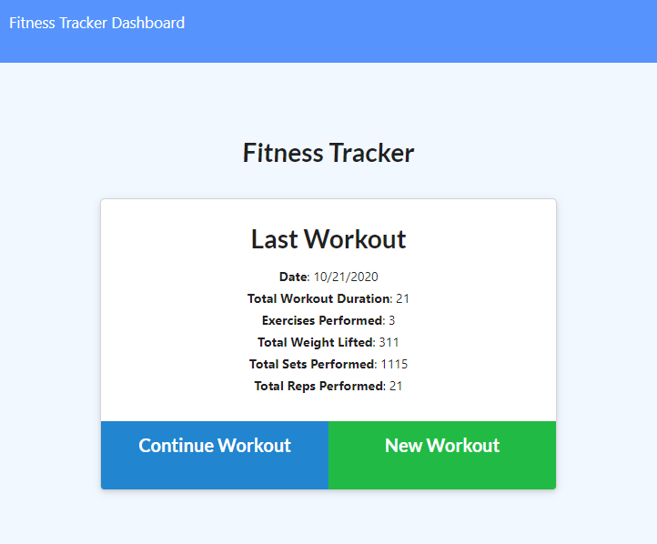

# Workout Tracker

## Description

Built the back end of the workout tracker to imitate building the backend to an already provided code!
The workout tracker can be used to build workouts with the option for further insights to

## Table Of Contents

- [Installation](#Installation)
- [Usage](#Usage)
- [Contributers](#Contributors)
- [Tests](#Tests)
- [License](#License)
- [Questions](#Questions)

## Installation

Install directly through github and run npm install. You can then deploy through heroku if you wanted a live site, or keep it on localhost.

## Usage

Just go straight to the heroku link provided and you can track your workouts and see your progress.

## Contributors

Sami Sully and Georgia Tech Bootcamp Students and Staff for teaching me to write this!

(https://www.github.com/SamiSully)

HTML, CSS, BOOTSTRAP, JAVASCRIPT, NODE.JS, JQUERY, EXPRESS, & MONGODB.

## License

MIT License

(https://choosealicense.com/licenses/mit/)

Copyright © Sami Sully 2020

## Questions

If you have any questions, you can reach out to me directly at samilsuly@gmail.com
